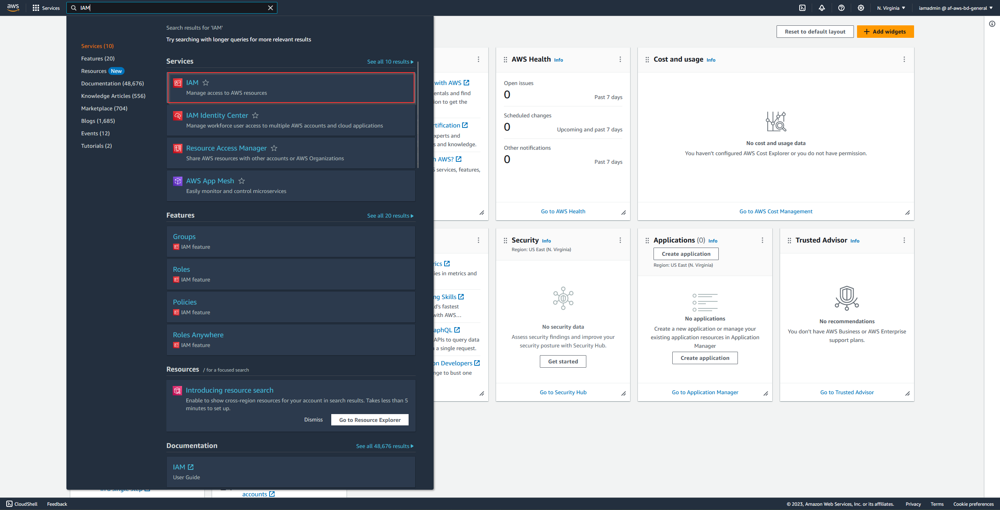

# Integrating Alexa with Home Assistant

This guide provides step-by-step instructions on how to connect your Alexa device with Home Assistant, allowing you to control your smart home devices using voice commands. This setup does not require Home Assistant Cloud.

## Prerequisites

To accomplish this project you need:

- A running instance of Home Assistant, which is available from internet via HTTPS on port 443.
- Amazon Developer Account to create an Amazon Alexa Smart Home Skill.
- Amazon Web Services account to create an Lambda function for Alexa Smart Home Skill.

## Step 1: Expose HA instance to Internet

In this step we will expose our internally running HA instance to the internet. There were two options which I was considering:

- Port Forwarding on the router.
- CloudFlare.

I've chosen the CloudFlare option, mainly because it looked easier to implement than the option with router maintenance. For this setup you will need: 

- Domain name.
- Cloudflare account.
- Cloudflare addon installed on Home Assistant instance.

### Domain Registration

Domain doesn't have to be purchased there are a lot of free options which can be used (duckdns.org or freenom.com). In my example I've bought an domain because the name which I wanted wasn't free.

</br>

On the screen there are already adjusted DNS server required for Cloudflare.

### Cloudflare Registration

In this step we need to create an new account in Cloudflare and register our domain. In this process we would get an two domain name servers which we need to put into configuration of our domain (Look step before - there are already External Name Servers). When we will update the DNS configuration on our provider page we will have to wait until we will got following email: 

</br>

This will mean that our domain was successfully registered.

### Addon Installation

Last step which we need to perform to expose our home assistant instance to the internet. Procedure is not very complicated. 

From our main page we need to go to 'Settings' > 'Addons' > 'Addons Store'


We need to add an following repository <code>https://github.com/brenner-tobias/ha-addons</code>. First in the right corner we need to click on three dots and after that on 'Repositories':

This will allow us to add cloudflare addon in our 'Addons Store':


We can now install the cloudflare addon and add our domain name in 'Config' tab. We also have to maintain the HA configuration file (configuration.yaml). We need to add two parameters to 'http' section (please look below). After those changes name we have to restart the addon.


<b>configuration.yaml</b>
```
http:
  use_x_forwarded_for: true
  trusted_proxies:
    - 172.30.33.0/24
```


After restart we have to go to logs to get the link which allow us to authorize the cloudflare tunnel to this instance.


Following link will take us to cloudflare tunnel authentication page, we need to wait few second and an pop-up window will open, on which we have to click 'Authorize'. After another few second we will get following result.


We can close this tab and go back to our addon logs on home assistant instance. If we did everything correctly we should see following log:


### Connection Setup

To visualize how our connection setup is looking like please see below picture.


## Step 2: Create an Amazon Alexa Smart Home Skill

### Login into the Alexa Developer Console

<a href ="https://developer.amazon.com/alexa/console/ask">Alexa Developer Console</a>

Go to 'Alexa Skills' and then click the 'Create Skill' to start the process. Provide an correct inputs (check screen below) and clik the 'Create Skill' to finish the process.


Make sure that 'v3' is selected in Payload version. Copy to notepad your Skill ID, it will be needed in next step. This is not the end of the configuration because we will have to go back there to fill the Default endpoint (will be generated in next step).


## Step 3: Create an AWS Lambda Function

In this step we will create an Lambda function which will be responsible to redirect requests from the Alexa Smart Home skill to our Home Assistance instance. To allow the Alexa integration in our HA instance to process the request and send back the response. The Lambda function will deliver this response back to Alexa Smart Home Skill.

### Create an IAM role for Lambda

Before we will create an AWS Lambda function we have to create an IAM role which will be used for AWS Lambda execution. After login into the AWS account, search for `IAM` then go to `Roles` and from there click on `Create Role` in right corner: 




While creating an new role we have to choose `AWS Services` and we need to search for `Lambda`. After clicking next, we will be asked to assign the permissions policies, we can pick the one called `AWSLambdaBasicExecutionRole` and once again click next. On the last screen we would be asked to provide an `Role Name` - something self describing.


That's all now we can move to creating the AWS Lambda function.

### Create Lambda Function

AWS Lambda creation we have to start with ensuring in which region we are currently located. Alexa Skills are only supported in certain AWS regions. Please be sure that you are in one of the following:

- `S East (N.Virginia)` region for English (US) or English (CA) skills.
- `EU (Ireland)` region for English (UK), English (IN), German (DE), Spanish (ES) or French (FR) skills.
- `US West (Oregon)` region for Japanese and English (AU) skills.

This can be checked in the top right corner left to your username.

From search bar, look for `Lambda`. Then in the right top corner click on `Create Function` and provide following inputs: `Author from scratch`,`Function name` - meaning full name, `Runtime` - Pick newest version of python. From the first dropdown select `Use existing role` and pick the one which we created in previous step. Then you can click on `Create Function`.


Now we should see an new window with an summary of our AWS Lambda function. First we have to create an new trigger for it. We can click on `Add trigger`, from the dropdown list we have to select `Alexa` and choose the option `Alexa Smart Home`. This will allow us to paste our skill ID created earlier. When everything will be maintain correctly, click on `Add`.


When we have AWS Lambda and trigger created we can paste the source code into the correct section and click on `Deploy` button. Python code can be found in this repository: <a href ="https://gist.github.com/matt2005/744b5ef548cc13d88d0569eea65f5e5b">click me</a>.


Before we will start testing this function we have to maintain an `Environment variables` and put at least one variable, called `BASE_URL`. This variable will be containing our Home Assistant public URL. navigate to `Configuration` tab, select `Environment variables` from the left menu and click on `Edit`. On the next page as key provide an `BASE_URL` and as value provide an URL for your HA instance. When it will be done click on `Save`.


Now AWS Lambda creation is completed, let's test if it's working.

### Test AWS Lambda Function

Before we start testing it we have to maintain the configuration file of our Home Assistant. Go to `configuration.yaml` file and add two lines to the config.

```
alexa:
  smart_home:
  ```


Restart your HA instance to reload the configuration and get back to Lambda function. Navigate to `Test` tab and select `Create new event`. Provide an name for your test case for example: `Dicsovery`. Entre following data in the code box called `Event JSON` and click `Create`

```
{
  "directive": {
    "header": {
      "namespace": "Alexa.Discovery",
      "name": "Discover",
      "payloadVersion": "3",
      "messageId": "1bd5d003-31b9-476f-ad03-71d471922820"
    },
    "payload": {
      "scope": {
        "type": "BearerToken"
      }
    }
  }
}
```


When the connection is possible you should get an green status of your test. In my example it's green but authorization failed as I didn't generated an token for this connection (for the final setup this isn't important).


### Finish configuration for Alexa Skills

Last step to finilize the configuration is to setup the endpoint of our previously created Alexa Skill and Link the account. First let's maintain the endpoint. We have to grab the `arn name` of our AWS Lambda function, get back to Alexa Developer Console and past is in `default endpoint`. After that click `Save` save in the top and you can start linking the accounts. 


Alexa needs to link your Amazon account to your Home Assistant account. Therefore HA can make sure only authenticated Alexa requests are able to access your home's devices. In this step you need to input all required details. Start from providing the `Authorization URI` and `Access Token URI`, usually those are following ones:

- `Authorization URI`: https://[YOUR HOME ASSISTANT URL]/auth/authorize
- `Access Token URI`: https://[YOUR HOME ASSISTANT URL]/auth/token

After that provide an `Client ID`, for each region it's different value (**don't remove slash at the end of string)**:

- https://pitangui.amazon.com/ if you are in US.
- https://layla.amazon.com/ if you are in EU.
- https://alexa.amazon.co.jp/ if you are in JP and AU (not verified yet).

`Secret ID` input anything you like, HA doesn't check this field. After that make sure that for `Your Authentication Scheme` *Credentials in request body* is selected. For the `Scope` put *smart_home*. Last two options can be left empty.


### Connect your HA instance with Alexa

After all of this now we can go to our Alexa app installed on our smartphone. From the menu, we have to go so `Skills&Games` and we have to enable our previously created skill. This will redirect us to our HA instance login page and allow us to authenticate ourselves. When the login would be successful, we should be able now to add our devices from HA to Alexa and control them from there.

#### Issue with EU region

https://community.home-assistant.io/t/alexa-skill-account-linking-invalid-redirect-uri/510683/3

According to above discussion if inside Alexa app you are not able to login to you HA instance, you need to perform whole configuration of AWS Lambda for USA region. After that it will work correctly.

## Documentation:
- CloudFlare: https://www.youtube.com/watch?v=yMmxw-DZ5Ec&pp=ygUaY2hyaXN0aWFuIGxlbXBhIGNsb3VkZmxhcmU%3D
- HA Config: https://hejdom.pl/blog/22-home-assistant/770-home-assistant-dostep-zdalny-ssl-cloudflare.html
- Officail HA docs: https://www.home-assistant.io/integrations/alexa.smart_home/
- Youtube video from <a href ="https://www.youtube.com/@EverythingSmartHome"> Everything Smart Home</a>: https://www.youtube.com/watch?v=Ww2LI59IQ0A&t=606s


